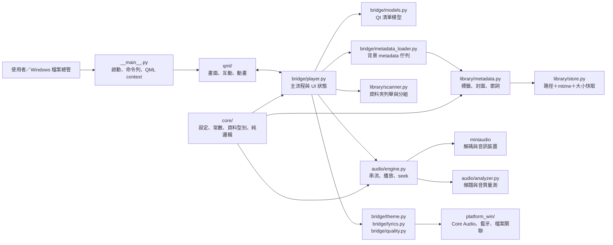
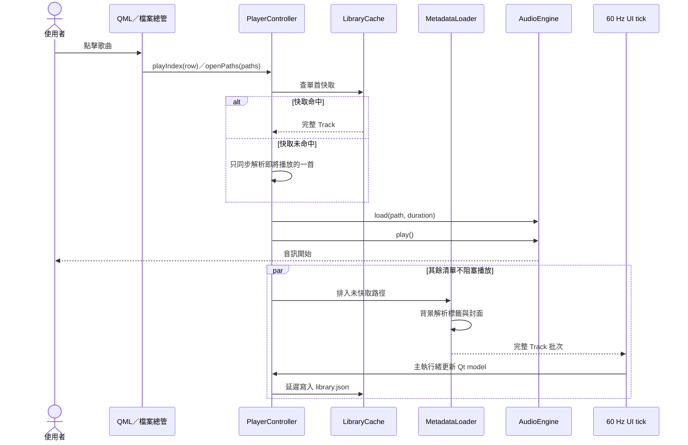
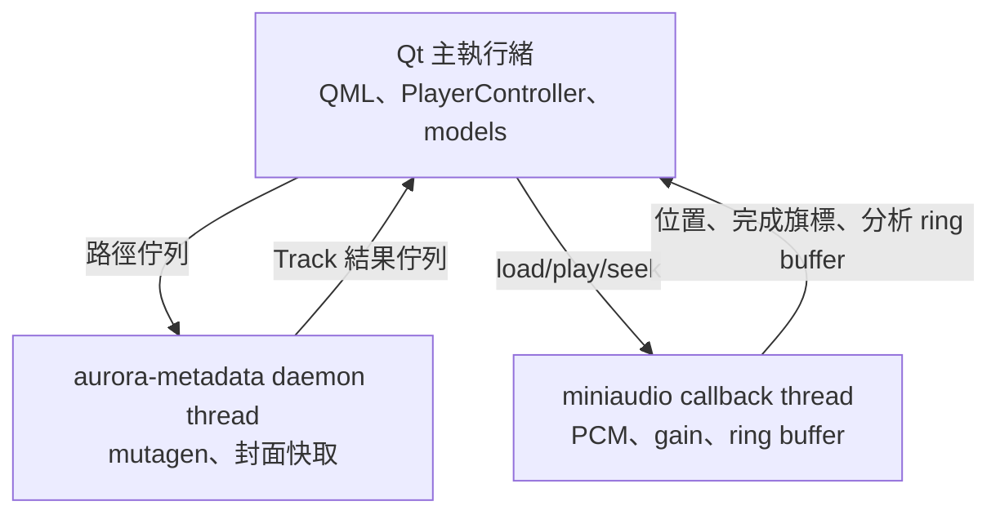

# AURORA 架構導航

這份文件回答三件事：功能應該去哪裡找、資料如何穿過各層，以及點擊歌曲後為什麼能立即開始播放。一般使用與建置方式仍以 [README.md](README.md) 為準。

## 一頁導航圖



依賴方向原則：`qml → bridge → audio/library/platform_win → core`。`core` 不依賴 Qt UI；`library/scanner.py` 保持純 Python，是否放到背景執行由 bridge 層決定。

## 目錄與責任索引

| 想修改的功能 | 入口 | 主要檔案 |
|---|---|---|
| App 啟動、外部檔案參數、視窗還原 | Python entry point | `src/aurora/__main__.py` |
| 點歌、播放清單、隨機／循環、生命週期 | UI controller | `src/aurora/bridge/player.py` |
| 播放清單、搜尋代理、頻譜／歌詞模型 | Qt models | `src/aurora/bridge/models.py` |
| 大量曲目的非同步標籤補齊 | Background loader | `src/aurora/bridge/metadata_loader.py` |
| MP3／FLAC／OGG／WAV 標籤與封面 | Metadata | `src/aurora/library/metadata.py` |
| 音樂資料夾遞迴列舉與分組 | Scanner | `src/aurora/library/scanner.py` |
| metadata 持久化快取 | Cache | `src/aurora/library/store.py` |
| 解碼、串流、音訊裝置、seek | Audio engine | `src/aurora/audio/engine.py` |
| FFT、頻譜、onset、rolloff | Analyzer | `src/aurora/audio/analyzer.py` |
| 封面色票、歌詞、音質報告 | ViewModels | `src/aurora/bridge/theme.py`, `lyrics.py`, `quality.py` |
| Windows 端點、藍牙、檔案關聯 | Platform adapter | `src/aurora/platform_win/` |
| UI 與動畫 | Qt Quick | `src/aurora/qml/Main.qml`, `src/aurora/qml/Aurora/` |
| 設定與共用不可變資料 | Core | `src/aurora/core/` |
| 安裝、打包、發行 | Tooling | `tools/`, `packaging/`, `aurora.spec` |

## 點擊歌曲到出聲的關鍵路徑



### 效能不變量

- 同步關鍵路徑只允許讀取「即將播放的一首」，不可逐首解析整張播放清單。
- 還原或切換資料夾歌單時，快取未命中的列先使用 `read_track_stub()`；檔名會立即出現，演出者、專輯、時長與封面稍後原地補齊。
- 背景執行緒不得操作 `QObject` 或 `QAbstractListModel`。它只產生 `Track`；模型更新由 `PlayerController._tick()` 在 Qt 主執行緒完成。
- cache key 是 `路徑 + mtime + 檔案大小`。檔案有變才重新讀標籤。
- 音訊必須繼續使用 `miniaudio.stream_file`；Windows 非 ASCII 路徑不能改成 `decode_file`。

## 啟動與外部點歌

`PlayerController.start()` 的順序是：啟動端點監看與 UI tick → 以快取／stub 還原清單 → 若有命令列歌曲就先載入並播放 → 最後列舉音樂庫資料夾。外部點歌不再等待整張歷史清單的 metadata，也不會因空清單的自動播放邏輯而重複載入同一首。

設定與快取位置：

| 資料 | 位置 | 寫入時機 |
|---|---|---|
| 設定、播放清單、目前位置 | `%APPDATA%\Aurora\config.json` | 關閉或設定變更 |
| 曲目 metadata | `%APPDATA%\Aurora\library.json` | 背景批次完成後延遲寫入 |
| 抽出的內嵌封面 | `%APPDATA%\Aurora\covers\` | 首次解析該封面 |

## 執行緒與訊號邊界



任何新背景工作都應沿用這個邊界：背景只做 I/O 或純計算，回傳不可變資料；Qt model 與 signal 的狀態變更集中在主執行緒。

## 驗證路線

```powershell
uv run ruff check .
uv run mypy
uv run pytest
$env:QT_QPA_PLATFORM = "offscreen"
uv run aurora --validate-qml
```

針對點歌延遲，至少守住以下回歸條件：

- `read_track_stub()` 不解析標籤、時長或封面。
- `MetadataLoader` 能在背景回傳完整曲目。
- 中文路徑仍由 `stream_file` 解碼。
- 外部 `openPaths()` 對空清單只載入／播放一次。
