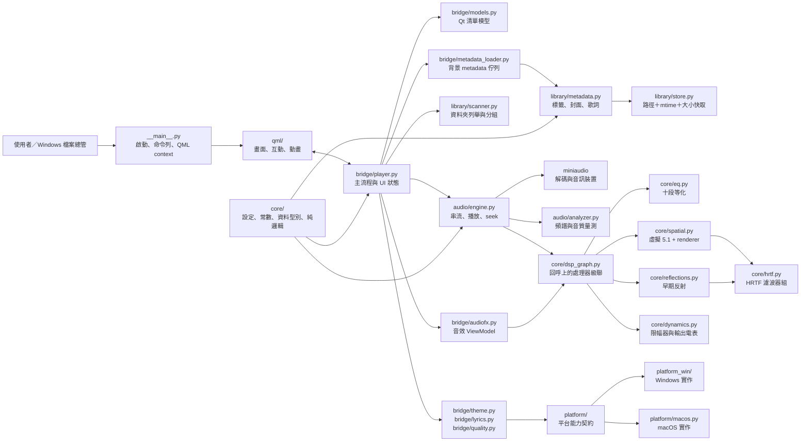
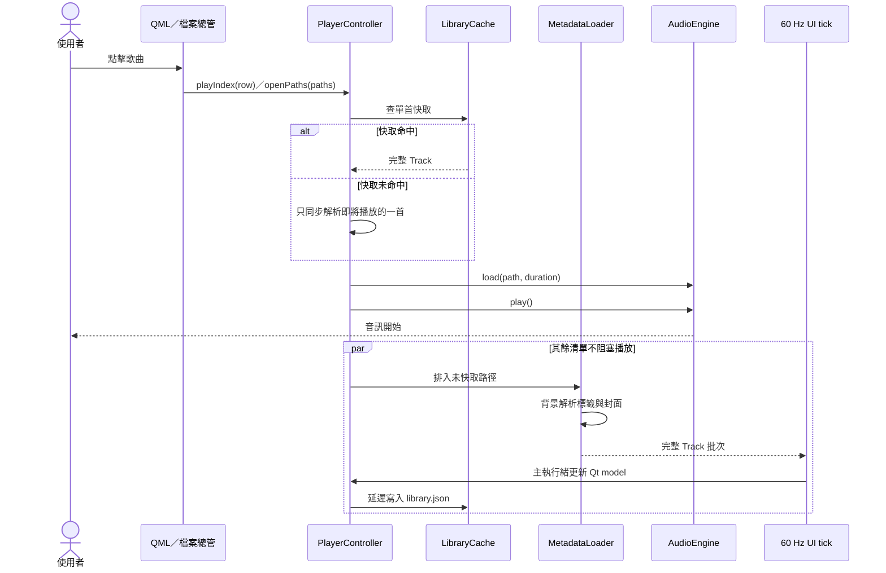
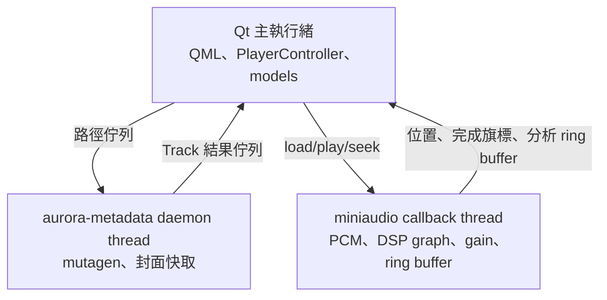

# AURORA 架構導航

這份文件回答三件事：功能應該去哪裡找、資料如何穿過各層，以及點擊歌曲後為什麼能立即開始播放。一般使用與建置方式仍以 [README.md](README.md) 為準。

## 一頁導航圖

```mermaid
flowchart LR
    User["使用者／Windows 檔案總管"] --> Entry["__main__.py<br/>啟動、命令列、QML context"]
    Entry --> QML["qml/<br/>畫面、互動、動畫"]
    QML <--> Player["bridge/player.py<br/>主流程與 UI 狀態"]

    Player --> Models["bridge/models.py<br/>Qt 清單模型"]
    Player --> Loader["bridge/metadata_loader.py<br/>背景 metadata 佇列"]
    Loader --> Metadata["library/metadata.py<br/>標籤、封面、歌詞"]
    Metadata --> Cache["library/store.py<br/>路徑＋mtime＋大小快取"]
    Player --> Scanner["library/scanner.py<br/>資料夾列舉與分組"]

    Player --> Engine["audio/engine.py<br/>串流、播放、seek"]
    Engine --> Miniaudio["miniaudio<br/>解碼與音訊裝置"]
    Engine --> Analyzer["audio/analyzer.py<br/>頻譜與音質量測"]
    Engine --> Graph["core/dsp_graph.py<br/>回呼上的處理器級聯"]
    Graph --> Eq["core/eq.py<br/>十段等化"]
    Graph --> Spatial["core/spatial.py<br/>虛擬 5.1 + renderer"]
    Graph --> Reflect["core/reflections.py<br/>早期反射"]
    Graph --> Dyn["core/dynamics.py<br/>限幅器與輸出電表"]
    Spatial --> Hrtf["core/hrtf.py<br/>HRTF 濾波器組"]
    Reflect --> Hrtf

    Player --> Fx["bridge/audiofx.py<br/>音效 ViewModel"]
    Fx --> Graph
    Player --> ViewModels["bridge/theme.py<br/>bridge/lyrics.py<br/>bridge/quality.py"]
    ViewModels --> Adapter["platform/<br/>平台能力契約"]
    Adapter --> Win["platform_win/<br/>Windows 實作"]
    Adapter --> Mac["platform/macos.py<br/>macOS 實作"]

    Core["core/<br/>設定、常數、資料型別、純邏輯"] --> Player
    Core --> Engine
    Core --> Metadata
```

依賴方向原則：`qml → bridge → audio/library/platform_win → core`。`core` 不依賴 Qt UI；`library/scanner.py` 保持純 Python，是否放到背景執行由 bridge 層決定。

## 目錄與責任索引

| 想修改的功能 | 入口 | 主要檔案 |
|---|---|---|
| App 啟動、外部檔案參數、視窗還原 | Python entry point | `src/aurora/__main__.py` |
| 點歌、播放清單、隨機／循環、生命週期 | UI controller | `src/aurora/bridge/player.py` |
| 播放清單、搜尋代理、頻譜／歌詞模型 | Qt models | `src/aurora/bridge/models.py` |
| 大量曲目的非同步標籤補齊 | Background loader | `src/aurora/bridge/metadata_loader.py` |
| MP3／FLAC／OGG／WAV 標籤與封面 | Metadata | `src/aurora/library/metadata.py` |
| 音樂資料夾遞迴列舉與分組 | Scanner | `src/aurora/library/scanner.py` |
| metadata 持久化快取 | Cache | `src/aurora/library/store.py` |
| 解碼、串流、音訊裝置、seek | Audio engine | `src/aurora/audio/engine.py` |
| FFT、頻譜、onset、rolloff | Analyzer | `src/aurora/audio/analyzer.py` |
| 封面色票、歌詞、音質報告 | ViewModels | `src/aurora/bridge/theme.py`, `lyrics.py`, `quality.py` |
| 回呼上的處理器級聯、掛載與降級 | DSP graph | `src/aurora/core/dsp_graph.py` |
| DSP 長度隨取樣率換算（STFT、FIR 抽頭） | DSP 共用 | `src/aurora/core/rates.py` |
| 等化器、限幅器、輸出電表 | 純邏輯處理器 | `src/aurora/core/eq.py`, `dynamics.py` |
| 虛擬 5.1、距離感、立體聲／HRTF renderer | Spatial | `src/aurora/core/spatial.py` |
| 早期反射（立體聲／雙耳兩條 renderer） | Reflections | `src/aurora/core/reflections.py` |
| HRTF 濾波器、實測資料載入、頻譜線索強度 | HRTF | `src/aurora/core/hrtf.py` |
| 音效面板的接線與設定持久化 | 音效 ViewModel | `src/aurora/bridge/audiofx.py` |
| 端點、藍牙、檔案關聯、系統偏好 | **平台契約** | `src/aurora/platform/`（上層只認識這裡） |
| Windows 專屬實作（COM、登錄檔） | Windows 實作細節 | `src/aurora/platform_win/`（**不要從上層直接 import**） |
| UI 與動畫 | Qt Quick | `src/aurora/qml/Main.qml`, `src/aurora/qml/Aurora/` |
| 設定與共用不可變資料 | Core | `src/aurora/core/` |
| 安裝、打包、發行 | Tooling | `tools/`, `packaging/`, `aurora.spec` |

## 點擊歌曲到出聲的關鍵路徑

```mermaid
sequenceDiagram
    actor U as 使用者
    participant UI as QML／檔案總管
    participant P as PlayerController
    participant C as LibraryCache
    participant M as MetadataLoader
    participant E as AudioEngine
    participant T as 60 Hz UI tick

    U->>UI: 點擊歌曲
    UI->>P: playIndex(row)／openPaths(paths)
    P->>C: 查單首快取
    alt 快取命中
        C-->>P: 完整 Track
    else 快取未命中
        P->>P: 只同步解析即將播放的一首
    end
    P->>E: load(path, duration)
    P->>E: play()
    E-->>U: 音訊開始

    par 其餘清單不阻塞播放
        P->>M: 排入未快取路徑
        M->>M: 背景解析標籤與封面
        M-->>T: 完整 Track 批次
        T->>P: 主執行緒更新 Qt model
        P->>C: 延遲寫入 library.json
    end
```

### 效能不變量

- 同步關鍵路徑只允許讀取「即將播放的一首」，不可逐首解析整張播放清單。
- 還原或切換資料夾歌單時，快取未命中的列先使用 `read_track_stub()`；檔名會立即出現，演出者、專輯、時長與封面稍後原地補齊。
- 背景執行緒不得操作 `QObject` 或 `QAbstractListModel`。它只產生 `Track`；模型更新由 `PlayerController._tick()` 在 Qt 主執行緒完成。
- cache key 是 `路徑 + mtime + 檔案大小`。檔案有變才重新讀標籤。
- 音訊必須繼續使用 `miniaudio.stream_file`；Windows 非 ASCII 路徑不能改成 `decode_file`。

## 啟動與外部點歌

`PlayerController.start()` 的順序是：啟動端點監看與 UI tick → 以快取／stub 還原清單 → 若有命令列歌曲就先載入並播放 → 最後列舉音樂庫資料夾。外部點歌不再等待整張歷史清單的 metadata，也不會因空清單的自動播放邏輯而重複載入同一首。

設定與快取位置：

| 資料 | 位置 | 寫入時機 |
|---|---|---|
| 設定、播放清單、目前位置 | `%APPDATA%\Aurora\config.json` | 關閉或設定變更 |
| 曲目 metadata | `%APPDATA%\Aurora\library.json` | 背景批次完成後延遲寫入 |
| 抽出的內嵌封面 | `%APPDATA%\Aurora\covers\` | 首次解析該封面 |

## 執行緒與訊號邊界

```mermaid
flowchart TB
    Main["Qt 主執行緒<br/>QML、PlayerController、models"]
    Worker["aurora-metadata daemon thread<br/>mutagen、封面快取"]
    Audio["miniaudio callback thread<br/>PCM、DSP graph、gain、ring buffer"]

    Main -->|"路徑佇列"| Worker
    Worker -->|"Track 結果佇列"| Main
    Main -->|"load/play/seek"| Audio
    Audio -->|"位置、完成旗標、分析 ring buffer"| Main
```

任何新背景工作都應沿用這個邊界：背景只做 I/O 或純計算，回傳不可變資料；Qt model 與 signal 的狀態變更集中在主執行緒。

**DSP 級聯跑在音訊回呼上**，所以它受同一條規則的更嚴格版本約束：不得配置
記憶體、不得發 Qt signal、不得取得會被主執行緒持有的鎖。處理器要回報狀態
（例如限幅器啟動、DSP 降級）時一律設旗標，由 `PlayerController._tick()`
在主執行緒撈出來 —— 與 `AudioEngine.take_finished` 同一個模式。
回呼的時間預算與實測數字見 [PROJECT_PLAN.md](PROJECT_PLAN.md) §9.4 與 §9.9。

## 驗證路線

命令與品質基準見 [README.md](README.md) 的「品質檢查」；
依變更類型該跑哪些 gate、以及結論該怎麼標示證據等級，見 [AGENTS.md](AGENTS.md)。

針對點歌延遲，本文件負責界定的回歸條件是：

- `read_track_stub()` 不解析標籤、時長或封面。
- `MetadataLoader` 能在背景回傳完整曲目。
- 中文路徑仍由 `stream_file` 解碼。
- 外部 `openPaths()` 對空清單只載入／播放一次。
